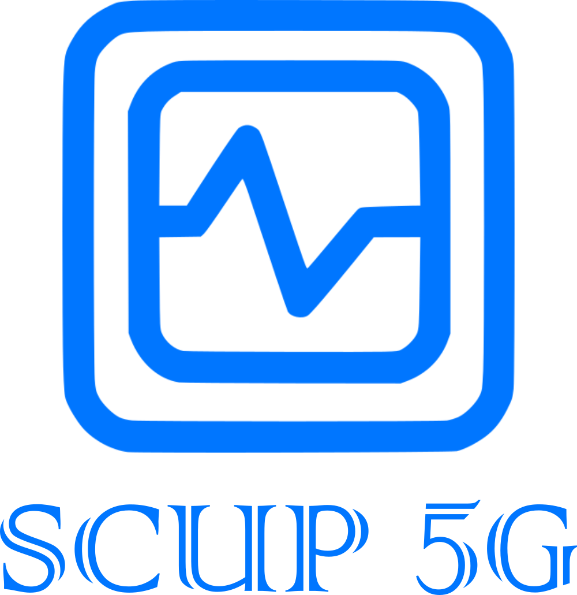
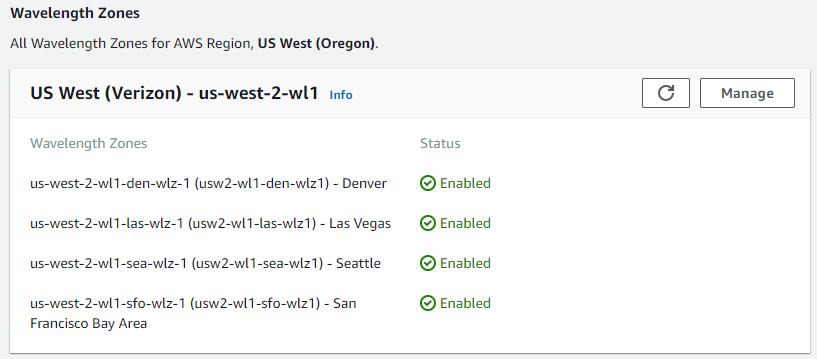
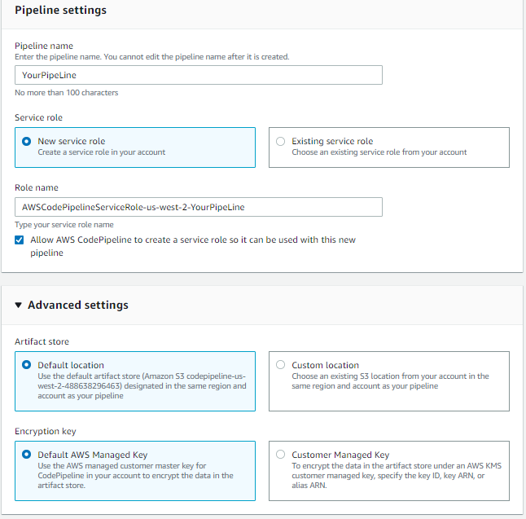

# SCUP-5G

  

# Table of contents:
 
- [SCUP-5G](#scup-5g)
- [Table of contents:](#table-of-contents)
- [Introduction:](#introduction)
- [Connection Diagram:](#connection-diagram)
  - [Server:](#server)
  - [App Diagram:](#app-diagram)
- [AWS Setup:](#aws-setup)
  - [Wavelength Zones:](#wavelength-zones)
  - [VPC:](#vpc)
  - [Gateway Carrier:](#gateway-carrier)
  - [EC2:](#ec2)
  - [Elastic IP:](#elastic-ip)
  - [Connection:](#connection)
- [Code CI/CD:](#code-cicd)
  - [CodePipeline:](#codepipeline)
  - [Code Source:](#code-source)
  - [CodeBuild:](#codebuild)
  - [CodeDeploy:](#codedeploy)
  - [Review:](#review)
  - [Check Deployment:](#check-deployment)
- [App UI:](#app-ui)
  - [**Login Screen**:](#login-screen)
  - [**Monitor Tab**:](#monitor-tab)
  - [**Summary**:](#summary)
  - [**Report**:](#report)
  - [**Additional notes**:](#additional-notes)
  - [**Past Reports**:](#past-reports)
  - [**ECG Details**:](#ecg-details)
  - [**Historical Tab**:](#historical-tab)
  - [**Simulator Tab**:](#simulator-tab)
      - [Functionality:](#functionality)

# Introduction:

Smart telemedicine platform, based on IoT devices that provide Vital signs and historical values. This to transform the way telemedicine is provided and solve the biggest problem in relation to distance check-ups, which is taking biometrics. Our current version consists of an Oxygen Saturation Thimble, an ECG sensor and a contactless Thermometer that can send real time information to a Teams application. This allowing distance consultations and follow ups to become more seamless and to grab a real biometrics and vital signs while doing them.

# Connection Diagram:

## Server:

## App Diagram:

# AWS Setup:

Para hacer funcionar la red de wavelength segui la siguiente documentacion de AWS, sin embargo mostrare algunos puntos importantes que hay que seguir para configurar correctamente todo.

https://docs.aws.amazon.com/wavelength/latest/developerguide/get-started-wavelength.html

## Wavelength Zones:

Debemos tener acceso a la zona wavelenght adecuada, por eso debemos de revisar que esta este activada como podemos ver en la imagen.

El test se va a realizar con la plataforma NOVA, en un celular conectado a la zona us-west-2-wl1-sfo-wlz-1

## VPC: 

La configuracion de la VPC debe ser la siguiente para que pueda conectarse a la red Wavelength correctamente.

Es importante que el IPv4 CIDR sea:
10.0.0.0/24

## Gateway Carrier:

En este paso lo importante sera seleccionar en la subnet la relgion correcta de AWS Wavelength.

## EC2:

La configuracion del EC2 es muy importante que se mantenga el los siguientes parametros:

Instance type:

- t3.medium, t3.xlarge, and r5.2xlarge for applications that need cost effective general purpose compute; 

- g4dn.2xlarge for applications that need GPUs such as game streaming and ML inference at the edge.

Tags:

Aunque es posible configurar configurar esto mas tarde, coloque los siguientes tags al final de la creacion de la instancia, estos serviran para realizar el despliegue de la app mas adelante.

Cualquier configuracion que desees realizar fuera de el tipo de instancia no hay ninguna restriccion.

Para hacer el despliegue correcto de la aplicacion es importante que el IAM role de nuestra instancia tenga los siguientes permisos habilitados.

## Elastic IP:

Una de las partes que puede dar mas problemas si no se realiza correctamente sera asignar el Elastic IP a nuestra instancia.

Solo tenemos que darle clic en asignar como muestra el recuadro.

## Connection:

Si todo lo que realizamos se hizo correctamente, deberemos de poder acceder a nuestra instancia desde la opcion que muestro a continuacion.

Gracias a que utilizaremos un pipeline de despliegue de codigo es todo el acceso que necesitamos.

# Code CI/CD:

## CodePipeline:

En AWS CodePipeline crea un pipeline con las siguientes caracteristicas.

## Code Source:

Selecciona a Github o el repositorio de codigo que prefieras como base.

## CodeBuild:

Ya que yo utilice una instancia de Ubuntu las especificaciones del build que yo utilice fueron las siguientes.

    # Do not change version. This is the version of aws buildspec, not the version of your buldspec file.
    version: 0.2
    phases:
      pre_build:
        commands:
          #installs dependencies into the node_modules/ directory
          - npm install
      build:
        commands:
          - echo Build started on `date`
          - echo Compiling
          - npm run build
      post_build:
        commands:
          - echo Build completed on `date`
    # Include only the files required for your application to run.
    artifacts:
      files:
        - public/**/*
        - src/**/*
        - package.json
        - appspec.yml
        - scripts/**/*

## CodeDeploy:

Al momento de configurar el deployment es muy imrpotante respetar las tags que utulizamos en la configuracion del EC2 para que la plataforma lo detecte correctamente.

Si todo funciono correctamente deberemos ver lo siguiente.

## Review:

Dentro de la carpeta de code revisar a detalle los scripts que correra la maquina para hacer todo el despliegue.

Code/scripts

A su vez los detalles del deployment estan definidos en el archivo.

Code/appspec.yml

Un review de nuestro pipeline es:

Ya que todo funciono correctamente deberemos ver que el pipeline funciono correctamente.

## Check Deployment:

CarrierIP:
[155.146.24.214](http://155.146.24.214)

Ahora podemos revisar que nuestra aplicacion esta correctamente desplegada al entrar dentro de un dispositivo con 5G gracias a plataforma de NOVA.

Aqui podemos ver como la pagina no es accesible si no estamos conectados a una zona 5G de Verizon, en este caso la pc esta conectado a un internet local normal.

# App UI:

La app para la prueba se revisara solo la version mobil ya que es el acceso que tenemos desde NOVA. Aunque la app es una PWA asi que puede funcionar en un escritorio conectado a una zona Wavelength tambien si quieren probarlo.

## **Login Screen**:

La login screen da acceso a la plataforma poniendo las siuientes credenciales.

Login Credentials:

    Email:drgregoryhouse@gmail.com
    Password:toor

**Desktop**:

**Mobile**:

## **Monitor Tab**:

The platform communicates with IoT devices through MQTT, which allows us to receive the data and graph it with the lowest possible latency.

ECG: 

The data received from the holter monitor is processed in real time on the page through a filter to be able to see the EKG graph correctly.

Oxygen Saturation:

The data received by the oxygen saturation sensor are:

- BPM.
- blood's SatO2.
- Plethysmography Curve

Temperature:

This sensor takes the temperature of the patient's hand.

To calculate the real temperature of the body, a multivariable linear regression model was performed to obtain an equation that would relate the temperature of the back of the hand and the ambient temperature, to obtain the real internal temperature of the body.

The data received by the platform is the calculated core body temperature.

Tab Explorer:

This section helps us to navigate between the 5 tabs that the monitor consists of.

Patient Data:

In this section we can see the patient's data, in addition to having a convenient button to switch between the English system and the international system for temperature.

**Desktop**:

**Mobile**:

## **Summary**:

In the summary we can see a summary of the general data of the patient and manipulate them as the doctor sees fit, all these data will be permanently modified once the submit button is clicked.

**Desktop**:

**Mobile**:

## **Report**: 

In this section the doctor will be able to fill in the data obtained during the consultation, the vital signs data are filled in automatically while the data is received. 

**Desktop**:

**Mobile**:

## **Additional notes**:

All the data that cannot be added through the report can be filled in this section, to be able to add tables, images or any type of additional data that is required.

**Desktop**:

**Mobile**:

## **Past Reports**:

In order to review the previous reports of any patient, once you select the patient, the dates of the previous reports will automatically appear so that you can display them.

**Desktop**:

**Mobile**:

## **ECG Details**:

In the case of the ECG details, we will have to be receiving ECG data (you can activate the simulator data), once we receive at least 10 - 15 seconds of data, the ECG symbol will turn from gray to red, this means that Once the pressures are done, we will send the data to an ECG analysis API to obtain relevant data for a doctor or physician/cardiologist.

**Desktop**:

**Mobile**:

## **Historical Tab**:

This tab has the function of displaying the stored data of the patients in their consultations, which is downloaded from a database that is updated as the patient has consultations.

To display the data we have to select the patient and then move on the calendar to review the data of the day that we need to display.

**Desktop**:

**Mobile**:

## **Simulator Tab**:

As this project is based on IoT 

This tab has the function of simulating the data in real time of a patient during a consultation, in order to use it, we will select a patient from the drop-down list and activate the sensors that we want to simulate, once the sensors that we want to simulate are in color, we will return to the monitor tab to be able to see the real-time data of the patient.

To Test this application enter here first!:

Pending LINK!

With these login credentials:

    Email:drgregoryhouse@gmail.com
    Password:toor

#### Functionality:

You can follow the next video to use the application:

Video: Click on the image

Or the following Instructions:

To test the simulator, we must log in to the page first:

Then, we will select one of the patients, in this case Victor Altamirano. We can see that no data appears yet.

Next, we go to the simulator tab. Select the patient we want to simulate and click on the buttons on the right, this will simulate one of the sensors.

We will activate the 3 sensors to show how they arrive at the platform at the same time.

To see this go back to the monitor tab.

Then deactivate 2 of them to show that now only the temperature arrives!

Only Temp arrives!

You can now check and play with various combinations of this.

**Desktop**:

**Mobile**:

