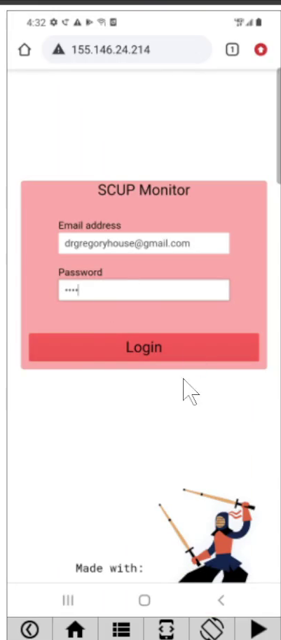
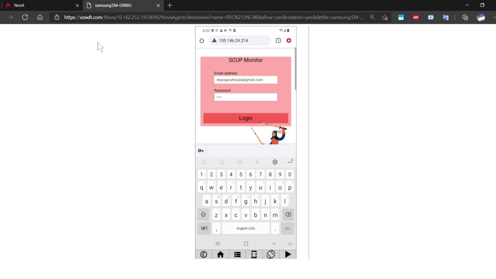
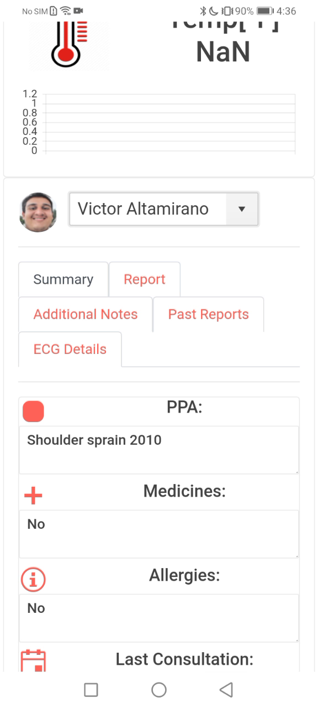
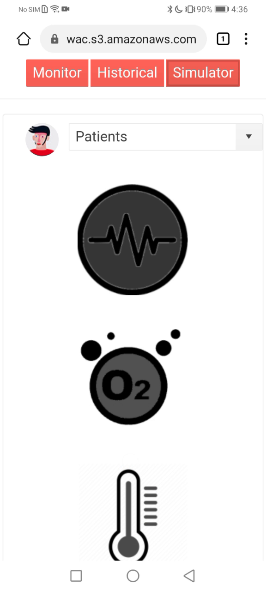
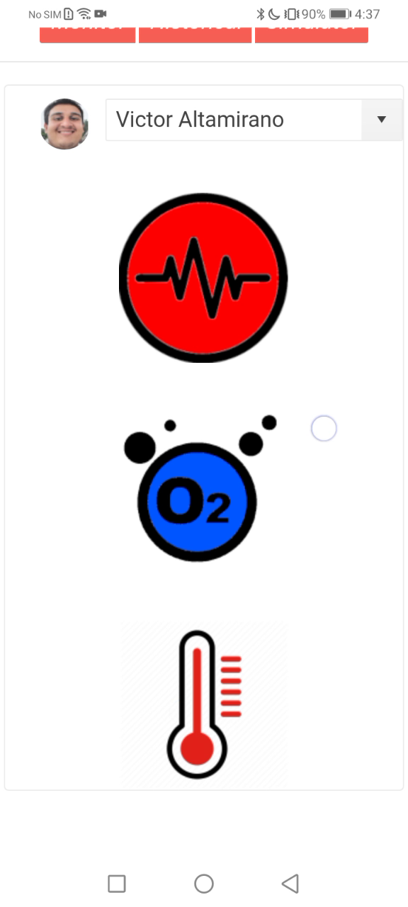
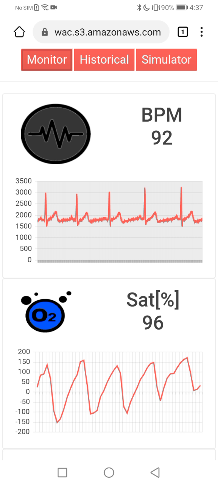

- [**Test:**:](#test)
  - [With 5G Mobile:](#with-5g-mobile)
  - [Without 5G and Nova Platform Access:](#without-5g-and-nova-platform-access)
  - [Witout 5G nor Nova Platform Access:](#witout-5g-nor-nova-platform-access)
  - [General Intructions:](#general-intructions)

# **Test:**:

As this project is based on IoT 

This tab has the function of simulating the data in real time of a patient during a consultation, in order to use it, we will select a patient from the drop-down list and activate the sensors that we want to simulate, once the sensors that we want to simulate are in color, we will return to the monitor tab to be able to see the real-time data of the patient.

You can follow the next video to use the application:

Video: Click on the image

Or the following Instructions:

Login credentials:

    Email:drgregoryhouse@gmail.com
    Password:toor

## With 5G Mobile:

Enter in the next link:

CarrierIP:
[155.146.24.214](http://155.146.24.214)

## Without 5G and Nova Platform Access:

Access to Nova Platform:

And test the URL in one of the available devices.

Enter in the next link:

CarrierIP:
[155.146.24.214](http://155.146.24.214)

## Without 5G nor Nova Platform Access:

Enter in the next link:

CarrierIP:
[SCUP Platform](https://scup-wwac.s3.amazonaws.com/index.html)

## General Intructions:

Login with this credentials:

    Email:drgregoryhouse@gmail.com
    Password:toor

To test the simulator, we must log in to the page first:

Then, we will select one of the patients, in this case Victor Altamirano. We can see that no data appears yet.

Next, we go to the simulator tab. Select the patient we want to simulate and click on the buttons on the right, this will simulate one of the sensors.

We will activate the 3 sensors to show how they arrive at the platform at the same time.

To see this go back to the monitor tab to check the charts.

